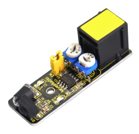
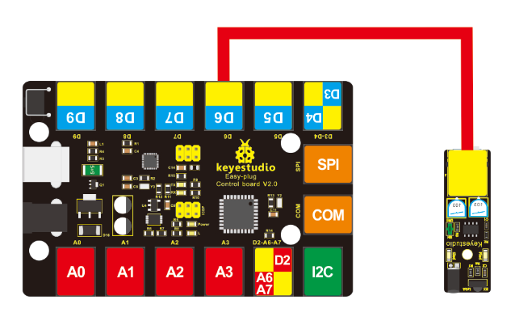
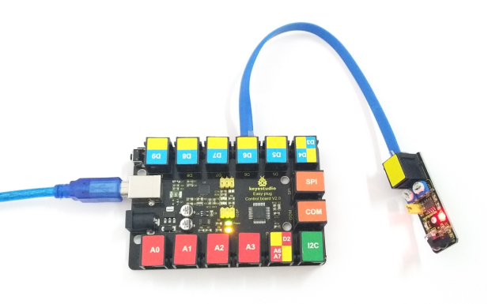
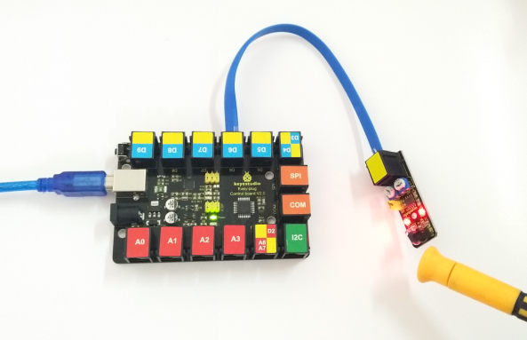

# KS0120 keyestudio EASY plug Infrared Obstacle Avoidance Sensor



## 1. Introduction

Infrared obstacle avoidance sensor is equipped with distance adjustment function and is especially designed for wheeled robots.

This sensor has strong adaptability to ambient light and is of high precision. It has a pair of infrared transmitting and receiving tube.

When infrared ray launched by the transmitting tube encounters an obstacle (its reflector), the infrared ray is reflected to the receiving tube, after a comparator circuit processing, the indicator will light up.

You can adjust the detection distance by rotating the potentiometer knob, the effective distance range of 2~40cm.

They can be widely used in robot obstacle avoidance, avoidance car, line count, and black and white line tracking and many other occasions.

This module should be used together with EASY plug control board.

**Special Note:**

The sensor/module is equipped with the RJ11 6P6C interface, compatible with our keyestudio EASY plug Control Board with RJ11 6P6C interface.

If you have the control board of other brands, it is also equipped with the RJ11 6P6C interface but has different internal line sequence, can’t be used compatibly with our sensor/module.

## 2. Specification

- Working voltage: DC 3.3V-5V
- Working current: ≥20mA
- Working temperature: －10℃ to＋50℃
- Detection distance: 2~40cm
- Output signal: TTL voltage
- Effective Angle: 35°

## 3. Technical Details

- Dimensions: 52mm * 17mm * 18mm
- Weight: 6.2g

## 4. Connect It Up

Connect the EASY Plug obstacle detector sensor and LED module to control board using RJ11 cables. Then connect the control board to your PC with a USB cable.



## 5. Test Code

Download code: [Code](./Code.7z)

```c
const int sensorPin=6;// the sensor pin
const int ledPin=13;// the LED pin
int sensorState=0;// variable for reading the sensor status

void setup()
{
    pinMode(ledPin,OUTPUT);
    pinMode(sensorPin,INPUT);
}

void loop() 
{
    // read the state of the sensor value:
    sensorState=digitalRead(sensorPin);
    // if it is, the sensorState is HIGH:
    if(sensorState==HIGH)
    {
    	digitalWrite(ledPin,HIGH);
    }
    else
    {
    	digitalWrite(ledPin,LOW);
    }
}
```

## 6. Result

Done uploading the code, when the sensor detects an obstacle, the led is turned on.



